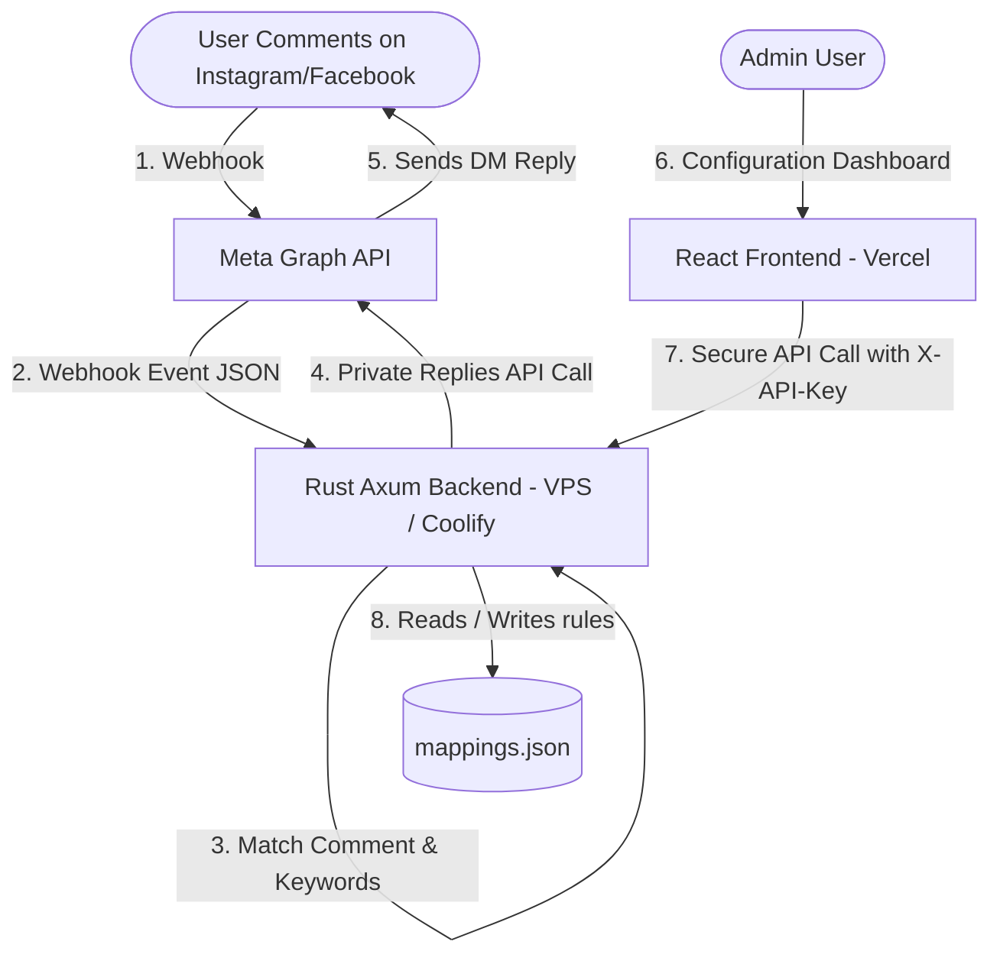

# meta-auto-byrexio: Decoupled Instagram & Facebook Comment Auto-DM

<p align="center">
  
</p>

A high-performance, ultra-lightweight, and secure monorepo containing a decoupled backend and frontend to automate private direct message (DM) responses on Instagram Business/Creator and Facebook Page comments.

---

## 🛠️ Project Architecture

This is a monorepo containing two main decoupled services:

```
instragram-automation/
├── backend/            # Rust & Axum High-Performance Web Server
├── frontend/           # Vite & React Glassmorphic Admin Dashboard
├── CONTRIBUTING.md     # Guidelines for project contributions
├── LICENSE             # MIT License
└── README.md           # Monorepo Documentation
```

### Flow Diagram


---

## 🚀 Key Features

- **Blazing Fast & Low Resource Footprint:** Backend written in Rust utilizing Axum and Tokio. Uses less than 5MB RAM (ideal for budget VPS hosts/Coolify).
- **Decoupled Admin Dashboard:** A sleek, glassmorphic dark-theme admin UI built in React & Vite to manage comment-response routing rules visually.
- **Dynamic Rule Mapping:** Configure triggers globally (`all` posts) or target specific Media IDs with case-insensitive keyword matchers.
- **Hot-Reloadable Mappings:** Backend reads rules dynamically from `mappings.json` without requiring server restarts.
- **Enhanced Security:** Token-based API Authentication (`X-API-Key`) ensures only authorized administrators can alter responder settings.
- **Containerized for Production:** Includes multi-stage Docker build files to optimize VPS image sizes (under 15MB).

---

## 💻 Tech Stack

### Backend
- **Language:** Rust (Edition 2024)
- **Web Framework:** [Axum](https://github.com/tokio-rs/axum)
- **Runtime:** [Tokio](https://github.com/tokio-rs/tokio) (Asynchronous)
- **HTTP Client:** [Reqwest](https://github.com/seanmonstar/reqwest) (configured with `rustls-tls` to avoid system OpenSSL dependencies)
- **Serialization:** [Serde JSON](https://github.com/serde-rs/json)

### Frontend
- **Framework:** [React 18+](https://react.dev/)
- **Build Tool:** [Vite](https://vite.dev/)
- **Icons:** [Lucide React](https://lucide.dev/)
- **Styling:** Vanilla CSS (Outfit Typography, Custom Transitions, responsive Glassmorphic grids)

---

## ⚡ Setup & Installation

Detailed setup and deployment guides are available in the subdirectories:

1. **[Backend Documentation & Setup Guide](backend/README.md):** Meta Developers Portal permissions list, Webhook Callback setup, and local environment execution parameters.
2. **[Frontend Documentation & Setup Guide](frontend/README.md):** Environment variables, development mode parameters, and building for production.

---

## 🔒 Security & Best Practices

- **Production Access Tokens:** For production environments, generate a **System User Token** in Meta Business Settings. It does not expire, unlike typical User or Page Access Tokens generated from the Graph API Explorer.
- **Admin API Key:** Change the default `ADMIN_API_KEY` (`admin_secret_token_123`) in your `.env` to a secure, random alphanumeric string before deploying to production.
- **HTTPS Enforced:** Meta requires Webhook Callback URLs to be encrypted via HTTPS/SSL. Ngrok or Cloudflare Tunnels (TryCloudflare) should be utilized for local development.

---

## 📄 License

This project is licensed under the MIT License. See the [LICENSE](LICENSE) file for details.
